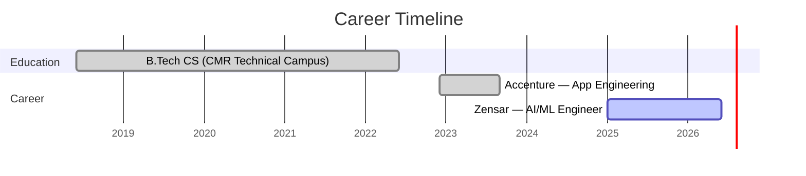

<div align="center">

<!-- Animated 3D Header Wave -->


<!-- Animated Typing SVG -->
<a href="https://git.io/typing-svg"></a>

<br/>

<!-- Connect -->
<a href="mailto:sriramblaze44@gmail.com"></a>
<a href="https://linkedin.com/in/sriram-makkapati"></a>
<a href="https://github.com/SriramMakkapati"></a>

</div>

<br/>

<!-- ABOUT ME -->
##  &nbsp;About Me


**AI Engineer** with **2.5+ years** building production GenAI systems and scalable applications.

I architect intelligent systems that think, reason, and act — from RAG pipelines that make LLMs reliable, to Agentic AI frameworks that automate complex workflows with multi-step reasoning.

```typescript
const sriram = {
    role: "AI Engineer @ Zensar Technologies",
    location: "Hyderabad, India",
    building: ["Agentic AI", "RAG Systems", "LLM Apps"],
    dailyStack: ["Python", "React", "LangChain", "OpenAI"],
    philosophy: "Engineer intelligence, not just features"
};
```

<br clear="right"/>

---

<!-- WHAT I BUILD -->
##  &nbsp;What I Build

<table>
<tr>
<td width="50%" valign="top">

<h3 align="center">🧠 AI & Generative AI</h3>

<div align="center">
<br/>

🔹 LLM-powered systems with prompt orchestration<br/>
🔹 RAG architectures with vector databases<br/>
🔹 Agentic AI with autonomous reasoning<br/>
🔹 LangGraph multi-step agent workflows<br/>
🔹 MCP (Model Context Protocol) integrations<br/>
🔹 OpenAI & Ollama model pipelines

</div>

</td>
<td width="50%" valign="top">

<h3 align="center">💻 Full Stack Engineering</h3>

<div align="center">
<br/>

🔹 React & Next.js production frontends<br/>
🔹 FastAPI & Flask async backends<br/>
🔹 REST API design & optimization<br/>
🔹 SQL & data modeling at scale<br/>
🔹 Azure cloud deployments<br/>
🔹 System design & architecture

</div>

</td>
</tr>
</table>

---

<!-- TECH STACK -->
##  &nbsp;Tech Stack

<div align="center">

### 🤖 AI / ML / GenAI
  


### 👨‍💻 Languages


### ⚡ Frameworks & Libraries


### ☁️ Cloud & Tools


</div>

---

<!-- EXPERIENCE -->
##  &nbsp;Professional Journey



<details>
<summary><b>🚀 Zensar Technologies — Software Engineer, AI/ML &nbsp;(Jan 2025 – Present)</b></summary>
<br/>

<table>
<tr><td>🤖</td><td>Built <b>LLM-powered Generative AI systems</b> with prompt engineering & orchestration → <code>~30% reduction</code> in manual processing</td></tr>
<tr><td>🧩</td><td>Designed <b>Agentic AI frameworks</b> enabling autonomous task execution through multi-step reasoning and tool integration</td></tr>
<tr><td>⚡</td><td>Engineered scalable <b>React/Next.js frontends</b> for AI-driven features, reducing response latency significantly</td></tr>
</table>

</details>

<details>
<summary><b>🔷 Accenture — Advanced App Engineering Associate &nbsp;(Dec 2022 – Sept 2023)</b></summary>
<br/>

<table>
<tr><td>🏗️</td><td>Engineered <b>full-stack applications</b> with scalable APIs, optimized database queries, and efficient backend processing</td></tr>
<tr><td>🎨</td><td>Designed <b>user-centric UI/UX</b> using React, ensuring seamless frontend-backend interaction for dynamic business needs</td></tr>
</table>

</details>

---

<!-- PROJECTS -->
##  &nbsp;Featured Projects

<div align="center">

<a href="https://github.com/SriramMakkapati/Project-Orion">

</a>

</div>

<br/>

> 🔮 **Project Orion** — Multi-source AI Research Agent with RAG, MCP, vector search & real-time streaming. Fully local, zero cost.
> <br/>`Next.js` `FastAPI` `LangChain` `ChromaDB` `Ollama` `MCP`

---

<!-- CERTIFICATIONS -->
## 🏅 Certifications

<div align="center">


</div>

---

<!-- CONTRIBUTION SNAKE -->
## 🐍 Contribution Graph

<div align="center">

<picture>
  <source media="(prefers-color-scheme: dark)" srcset="https://raw.githubusercontent.com/SriramMakkapati/SriramMakkapati/output/github-snake-dark.svg" />
  <source media="(prefers-color-scheme: light)" srcset="https://raw.githubusercontent.com/SriramMakkapati/SriramMakkapati/output/github-snake.svg" />
  
</picture>

</div>

---

<!-- ACTIVITY GRAPH -->
## 📈 Activity

<div align="center">


</div>

---

<!-- QUOTE -->
<div align="center">

<br/>


<br/><br/>

### 🤝 Let's Build Something Intelligent Together

<br/>

<a href="mailto:sriramblaze44@gmail.com"></a>
&nbsp;&nbsp;
<a href="https://linkedin.com/in/sriram-makkapati"></a>

<br/><br/>

</div>

<!-- Animated Footer -->

