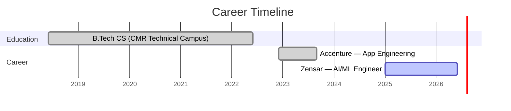

<div align="center">

<!-- 3D ANIMATED HEADER -->


<!-- TYPING ANIMATION -->
<a href="https://git.io/typing-svg"></a>

<br/><br/>

<!-- SOCIAL LINKS -->
<a href="mailto:sriramblaze44@gmail.com"></a>&nbsp;
<a href="https://linkedin.com/in/sriram-makkapati"></a>&nbsp;
<a href="https://github.com/SriramMakkapati"></a>

</div>

---

<!-- ABOUT ME -->
## ⚡ About Me

<table>
<tr>
<td width="60%" valign="top">

**AI Engineer** with **2.5+ years** building production GenAI systems and scalable applications.

I architect intelligent systems that think, reason, and act — from RAG pipelines that make LLMs reliable, to Agentic AI frameworks that automate complex workflows with multi-step reasoning.

```typescript
const sriram = {
    role: "AI Engineer @ Zensar Technologies",
    location: "Hyderabad, India",
    building: ["Agentic AI", "RAG Systems", "LLM Apps"],
    dailyStack: ["Python", "React", "LangChain", "OpenAI"],
    philosophy: "Engineer intelligence, not just features"
};
```

</td>
<td width="40%" align="center" valign="top">


<br/>

🏢 &nbsp; Working at **Zensar Technologies**

🧠 &nbsp; Specializing in **Agentic AI & RAG**

🚀 &nbsp; Building with **LangGraph & MCP**

🎓 &nbsp; B.Tech CS, CMR Technical Campus

📍 &nbsp; Hyderabad, India

<br/>


</td>
</tr>
</table>

---

<!-- WHAT I BUILD -->
## 🎯 What I Build

<table>
<tr>
<td width="50%" valign="top">

### 🧠 &nbsp;AI & Generative AI

```
▸ LLM-powered systems with prompt orchestration
▸ RAG architectures with vector databases
▸ Agentic AI with autonomous reasoning
▸ LangGraph multi-step agent workflows
▸ MCP (Model Context Protocol) integrations
▸ OpenAI & Ollama model pipelines
```

</td>
<td width="50%" valign="top">

### 💻 &nbsp;Full Stack Engineering

```
▸ React & Next.js production frontends
▸ FastAPI & Flask async backends
▸ REST API design & optimization
▸ SQL & data modeling at scale
▸ Azure cloud deployments
▸ System design & architecture
```

</td>
</tr>
</table>

---

<!-- TECH STACK -->
## 🛠️ Tech Stack

<div align="center">

#### 🤖 AI / ML / GenAI
  


#### 👨‍💻 Languages


#### ⚡ Frameworks & Libraries


#### ☁️ Cloud & DevOps


</div>

---

<!-- EXPERIENCE -->
## 💼 Professional Journey



<details>
<summary><b>🚀 &nbsp;Zensar Technologies — Software Engineer, AI/ML &nbsp;(Jan 2025 – Present)</b></summary>
<br/>

| | Impact |
|---|---|
| 🤖 | Built **LLM-powered Generative AI systems** with prompt engineering & orchestration → `~30% reduction` in manual processing |
| 🧩 | Designed **Agentic AI frameworks** enabling autonomous task execution through multi-step reasoning and tool integration |
| ⚡ | Engineered scalable **React/Next.js frontends** for AI-driven features, reducing response latency significantly |

</details>

<details>
<summary><b>🔷 &nbsp;Accenture — Advanced App Engineering Associate &nbsp;(Dec 2022 – Sept 2023)</b></summary>
<br/>

| | Impact |
|---|---|
| 🏗️ | Engineered **full-stack applications** with scalable APIs, optimized database queries, and efficient backend processing |
| 🎨 | Designed **user-centric UI/UX** using React, ensuring seamless frontend-backend interaction for dynamic business needs |

</details>

---

<!-- FEATURED PROJECT -->
## 🔮 Featured Project

<div align="center">

<a href="https://github.com/SriramMakkapati/Project-Orion">

</a>

<br/><br/>

**🔮 Project Orion** — Multi-source AI Research Agent with RAG, MCP, vector search & real-time streaming.

`Next.js` `FastAPI` `LangChain` `ChromaDB` `Ollama` `MCP` `SSE Streaming`

*Fully local • Zero cost • Complete data privacy*

</div>

---

<!-- CERTIFICATIONS -->
## 🏅 Certifications

<div align="center">


</div>

---

<!-- FOOTER -->
<div align="center">

<br/>

```
 "The best AI systems aren't the ones that replace humans
  — they're the ones that amplify human potential."
```

<br/>

<a href="mailto:sriramblaze44@gmail.com"></a>&nbsp;&nbsp;
<a href="https://linkedin.com/in/sriram-makkapati"></a>

<br/><br/>

</div>

<!-- 3D ANIMATED FOOTER -->

