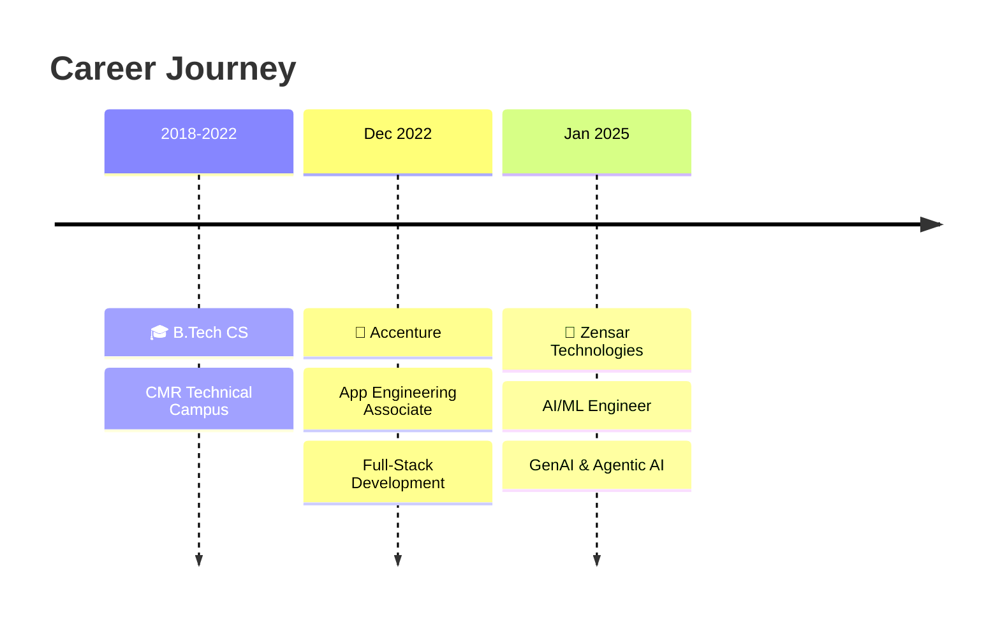

<div align="center">

<!-- 3D Animated Header -->


<!-- Animated Typing -->
<a href="https://git.io/typing-svg"></a>

<br/>

<!-- 3D Profile Views Counter -->


<br/><br/>

<!-- Social Badges with 3D effect -->
[](mailto:sriramblaze44@gmail.com)
[](https://linkedin.com/in/sriram-makkapati)
[](https://github.com/SriramMakkapati)

</div>

---

<!-- About Section with 3D Card Effect -->


##  About Me

```yaml
name: Sriram Makkapati
role: AI Engineer
experience: 2.5+ years
location: Hyderabad, India
education: B.Tech in Computer Science

currently:
  company: Zensar Technologies
  building: LLM-powered GenAI Systems & Agentic AI Frameworks
  
passion: Transforming complex data into intelligent, autonomous systems
```

<br clear="right"/>

> *"I don't just build applications — I engineer intelligence into them."*

---

## 🚀 What I Do

<table>
<tr>
<td width="50%">

### 🧠 AI & GenAI
- Generative AI systems with prompt engineering
- RAG architectures with vector databases
- Agentic AI with multi-step reasoning
- LangGraph & MCP orchestration
- OpenAI API integration

</td>
<td width="50%">

### 💻 Full Stack
- React & Next.js frontends
- Python backends (FastAPI, Flask)
- REST APIs & system design
- Data modeling & SQL optimization
- Azure cloud deployment

</td>
</tr>
</table>

---

## 🛠️ Tech Arsenal

<div align="center">

<!-- AI/ML -->


<br/><br/>

<!-- Languages -->


<br/><br/>

<!-- Frameworks -->


<br/><br/>

<!-- Tools & Cloud -->


</div>

---

## 💼 Experience

<div align="center">



</div>

<details>
<summary><b>🟣 Zensar Technologies — Software Engineer, AI/ML (Jan 2025 – Present)</b></summary>
<br/>

| Impact | Description |
|--------|-------------|
| 🤖 | Built LLM-powered GenAI systems with prompt engineering & orchestration → **~30% reduction** in manual effort |
| 🧩 | Designed Agentic AI frameworks with autonomous multi-step reasoning & tool integration |
| ⚡ | Engineered React/Next.js frontends for AI-driven features with optimized response latency |

</details>

<details>
<summary><b>🔵 Accenture — Advanced App Engineering Associate (Dec 2022 – Sept 2023)</b></summary>
<br/>

| Impact | Description |
|--------|-------------|
| 🏗️ | Engineered full-stack apps with scalable APIs & optimized database queries |
| 🎨 | Designed user-centric UI/UX with React for seamless frontend-backend interaction |

</details>

---

## 🏆 Featured Projects

<div align="center">

<a href="https://github.com/SriramMakkapati/Project-Orion">

</a>

</div>

<br/>

| Project | Description | Tech |
|---------|-------------|------|
| 🔮 **Project Orion** | Multi-source AI Research Agent with RAG, MCP, vector search & streaming | Next.js, FastAPI, LangChain, ChromaDB, Ollama |
| 📊 **Data Explorer** | LLM-powered conversational system for natural language dataset interaction | OpenAI API, Python, React |
| 🔍 **Data Profiling Engine** | Agentic AI system for automated profiling, anomaly detection & monitoring | Python, LangGraph, Agentic AI |
| 🔄 **Tech Modernization Platform** | AI pipeline for cross-language code conversion & documentation generation | GenAI, LangChain, Python |
| 📈 **AI Data Visualization** | Interactive dashboards transforming raw data into AI-powered insights | React, Next.js, Python |

---

## 📊 GitHub Analytics

<div align="center">


<br/><br/>


</div>

---

## 🏅 Certifications

<div align="center">


</div>

---

## 🐍 Contribution Graph

<div align="center">

<picture>
  <source media="(prefers-color-scheme: dark)" srcset="https://raw.githubusercontent.com/SriramMakkapati/SriramMakkapati/output/github-snake-dark.svg" />
  <source media="(prefers-color-scheme: light)" srcset="https://raw.githubusercontent.com/SriramMakkapati/SriramMakkapati/output/github-snake.svg" />
  
</picture>

</div>

---

<div align="center">

## 💡 Philosophy

*"The best AI systems aren't the ones that replace humans — they're the ones that amplify human potential."*

<br/>

### Let's build something intelligent together 🚀

<br/>

<a href="mailto:sriramblaze44@gmail.com">

</a>

</div>

<!-- 3D Animated Footer -->

